# Mobile-Introduction - CV-Online

# Objetivo: 
Este repositório tem como objetivo dar uma introdução rápida ao desenvolvimento de um app para dispositivos android com o foco em aplicações mobile. 

A ideia é de forma rápida e objetiva conseguir instalar e utilizar um app no celular.

Todo o guia vai ser baseado em react native em função de sua pratividade e facilidade na analise e aprendizado, além de ser um frameork bem aceito no mercado. 

## Pré Requisitos

Esta seção aborda os pré requisistos necessários para podermos proseguir com o aprendizado.

### Pré Requisitos

- [Expo - instalção no dispositivo mobile](https://expo.dev/go/)
- [Node.JS ](https://nodejs.org/en)
- [VS Code](https://code.visualstudio.com/)

Ajuste de politica de execução do PowerShell. Por padrão, o PowerShell não permite a execução de scripts não assinados, como o **npx**. Abaixo o comando para o determinado ajuste.

- Abrir o PowerShell como Administrador
- Pressione **Win + X** e selecione **"Windows PowerShell (Admin)"**.
- Ou procure por **"PowerShell"** no menu iniciar, clique com o botão direito e escolha **"Executar como Administrador"**.
- Digite o seguinte comando no PowerShell para permitir a execução de scripts locais:

```powershell
Set-ExecutionPolicy RemoteSigned -Scope CurrentUser
```

### Familizarização

Links de conhecimento relacionado ao TypeScript e ao React.

- [Introdução ao TS](https://www.typescriptlang.org/docs/handbook/2/everyday-types.html)
- [Introdução ao React](https://react.dev/learn) 

## 1 - Criando seu primeiro APP

### 1 Inicializar um novo aplicativo EXPO

Dentro do nosso terminal do VS Code, criaremos o nosso app através de uma linha de comando. Lembrando que aqui, temos que executar o comando extamente onde queremos que o projeto seja inicializado. 

obs: Recomendo que criem uma pasta na raiz do computador conforme modelo abaixo:

c:\desenvolvimento\mobile\

```sh
npx create-expo-app@latest quiz-app
```
O comando vai criar um diretório usando um modelo padrão de app, com biblioteca essenciais. 

Algumas Vantagens de usar um modelo padrão para desenvolvimento:
- Cria um novo projeto React Native com expoo pacote instalado
- Inclui ferramentas recomendadas, como Expo CLI
- Inclui um navegador de abas do Expo Router para fornecer um sistema de navegação básico
- Configurado automaticamente para executar um projeto em várias plataformas: Android, iOS e web
TypeScript configurado por padrão

### 2 Script Reset

Como vamos criar o nosso aplicativo do zero, vamos resetar ele e com isto retirar alguns arquivos desnecessários. 

```sh
npm run reset-project
```

Com isto nossa pasta de APP fica com dois arquivos ( index.tsx e _layout.tsx ) os demais foram movidos para a pasta app-example. 

### 3 executando o aplicativo no Celular

Primeiramente executamos o comando abaixo para instalar as dependencias caso falte alguma relacionado ao ferramental do expo. 


Dependencias necessarias, toast traz um tipo especial de msnegaem.
Async storage é para salvar as cosias no sd do andriod.
```sh
npm install expo
npm install react-native-toast-message 
npx expo install @react-native-async-storage/async-storage
```


Posterior iniciamos o nosso projeto com o comando abaixo.

```sh
npx expo start
```
Se no momento da instalação, aparecer uma mensagem solicitando a liberação do node.js no firewall do windoes, libere tanto para redes publicas como privadas. Este passo é bem iportante pois caso não configuremos estas permissoes, podemos ter impacto para emular o projeto. 

O comando acima iniciara o nosso servidor de desenvolvimento. Caso solicite para instalar alguma dependencia a mesma deve ser instalada.

Estado da nossa aplicação até o momento:

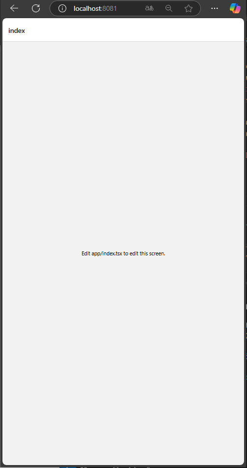

## 2 - Começando 

### 1 Entendendo Quiz-App

Vamos criar um app de perguntas com respostas, onde intuito e passarmos por 5 perguntas e ao final de tudo termos uma pontuação no ranking.

A ideia no futuro é integrarmos as perguntas ao GPT, ele nos realizando perguntas de forma automatica e dinamica. 

### 2 Iniciando o desenvolvimento

Vamos seguir a seguinte estrutura para o nosso projeto conforme abaixo. Ainda não é necessário criar toda astrutura, ela vai ir evoluindo conforme formos realizando os fluxos do passo a passo. 

```java
cv-onilne/
├── app/
│   ├── index.tsx         <- Tela principal (Vamos colocar o quiz-app aqui)
│   ├── _layout.tsx
│   └── ...
├── component
│   ├── ?.tsx        <- comopnent a ser criado 
│   ├── ?.tsx        <- comopnent a ser criado 
└── ......
```

Primeiramente vamos realizar alguns ajustes simples na nossa tela inicial conforme código abaixo: 

```tsx
// app/index.tsx
import { View, Text, StyleSheet } from 'react-native';

export default function HomeScreen() {
  return (
    <View style={styles.container}>
      <Text style={styles.title}>Quiz Interativo 🤓</Text>
      <Text style={styles.subtitle}>Toque para começar</Text>
    </View>
  );
}

const styles = StyleSheet.create({
    container: {
    flex: 1,
    backgroundColor: '#121212', // fundo preto
    alignItems: 'center',
    justifyContent: 'center',
    padding: 16,
  },
  title: {
    fontSize: 28,
    fontWeight: 'bold',
    marginBottom: 12,
    color: '#fff', // texto branco
  },
  subtitle: {
    fontSize: 18,
    color: '#bbb', // cinza claro
    marginBottom: 24,
    textAlign: 'center',
  },
});

```


<details>
  <summary>🧠 O que esse código faz:</summary>

---
📦 1. Imports (importação de bibliotecas)

```tsx
import { View, Text, StyleSheet } from 'react-native';
```

- Importa componentes do React Native:
- View: uma "caixa" para agrupar outros elementos.
- Text: para exibir textos.
- StyleSheet: para criar estilos personalizados.

---

🧠 2. Componente principal (HomeScreen)

```tsx

export default function HomeScreen() {
  return (
    <View style={styles.container}>
      <Text style={styles.title}>Quiz Interativo 🤓</Text>
      <Text style={styles.subtitle}>Toque para começar</Text>
    </View>
  );
}

```

- Função HomeScreen é o que será exibido na tela.
- View é o contêiner principal.
- Dentro dele, dois textos:
   - Um título chamativo.
   - Um subtítulo com instrução.

---
3 🎨 Estilos Personalizados

```ts
const styles = StyleSheet.create({
    container: {
    flex: 1,
    backgroundColor: '#121212', // fundo preto
    alignItems: 'center',
    justifyContent: 'center',
    padding: 16,
  },
  title: {
    fontSize: 28,
    fontWeight: 'bold',
    marginBottom: 12,
    color: '#fff', // texto branco
  },
  subtitle: {
    fontSize: 18,
    color: '#bbb', // cinza claro
    marginBottom: 24,
    textAlign: 'center',
  },
});

```

- container: ocupa toda a tela (flex: 1), fundo branco, centraliza o conteúdo.
- title: texto grande e em negrito.
- subtitle: texto menor e com cor cinza.

---


</details>


### 2 - Primeiro Componente

Vamos criar o componente QuestionCard.tsx, no qual vai possuir uma constante para controlar a pergunta e a resposta. 

Este componente é um pouco mais complexo, vamos colocar ele completo aqui e depois explicamos o que ele faz.

Primeiramente temos que criar a pasta components no diretório principal do nosso projeto, posterior adicionamos o arquivo QuestionCard.tsx, com o seguinte conteudo: 

```tsx
// components/QuestionCard.tsx
import React, { useState } from 'react';
import { View, Text, TouchableOpacity, StyleSheet } from 'react-native';

const question = {
  text: 'Qual desses é um componente do React Native?',
  options: ['div', 'section', 'View', 'body'],
  correctAnswerIndex: 2,
};

export default function QuestionCard() {
  const [selectedOption, setSelectedOption] = useState<number | null>(null);

  const handleOptionPress = (index: number) => {
    setSelectedOption(index);
  };

  return (
    <View style={styles.card}>
      <Text style={styles.question}>{question.text}</Text>

      {question.options.map((option, index) => {
        const isSelected = selectedOption === index;
        const isCorrect = selectedOption === question.correctAnswerIndex;

        let backgroundColor = '#333';
        if (selectedOption !== null) {
          if (isSelected && isCorrect) backgroundColor = '#388e3c'; // Verde escuro
          else if (isSelected) backgroundColor = '#d32f2f'; // Vermelho escuro
        }

        return (
          <TouchableOpacity
            key={index}
            style={[styles.optionButton, { backgroundColor }]}
            onPress={() => handleOptionPress(index)}
            disabled={selectedOption !== null}
          >
            <Text style={styles.optionText}>
              {String.fromCharCode(65 + index)}. {option}
            </Text>
          </TouchableOpacity>
        );
      })}
    </View>
  );
}

const styles = StyleSheet.create({
  card: {
    backgroundColor: '#1e1e1e', // caixa mais clara sobre o fundo escuro
    borderRadius: 12,
    padding: 20,
    shadowColor: '#000',
    shadowOpacity: 0.3,
    shadowRadius: 6,
    elevation: 3,
  },
  question: {
    fontSize: 20,
    fontWeight: 'bold',
    marginBottom: 20,
    color: '#fff',
  },
  optionButton: {
    padding: 12,
    borderRadius: 8,
    marginBottom: 10,
  },
  optionText: {
    fontSize: 16,
    color: '#fff',
  },
});

```


<details>
<summary>🧠 O que esse código faz?</summary>

---

📦 Importações

```tsx
import React, { useState } from 'react';
import { View, Text, TouchableOpacity, StyleSheet } from 'react-native';
```
- React e useState: usamos useState para controlar qual opção foi escolhida.

Componentes do React Native:
- View: contêiner.
- Text: textos.
- TouchableOpacity: botão que reage ao toque.
- StyleSheet: estilos personalizados.
---

❓ Pergunta e Alternativas

```tsx
const question = {
  text: 'Qual desses é um componente do React Native?',
  options: ['div', 'section', 'View', 'body'],
  correctAnswerIndex: 2,
};
```

- Uma pergunta fixa com 4 opções.
- A resposta correta é o índice 2, que corresponde a "View".

---

💡 Componente Principal

```tsx
export default function QuestionCard() {
  const [selectedOption, setSelectedOption] = useState<number | null>(null);
```

- Criamos um estado chamado selectedOption para armazenar a resposta do usuário.
- Começa como null (nenhuma opção selecionada).

🎯 Função ao Selecionar Opção

```tsx
const handleOptionPress = (index: number) => {
  setSelectedOption(index);
};
```

- Quando o usuário toca em uma opção, essa função guarda o índice da opção clicada.

---

🖼️ Renderizando a Pergunta e Opções

```tsx
<View style={styles.card}>
  <Text style={styles.question}>{question.text}</Text>
```

- Mostra a pergunta em destaque.

```tsx
{question.options.map((option, index) => {
  const isSelected = selectedOption === index;
  const isCorrect = selectedOption === question.correctAnswerIndex;
```
Para cada opção:
- isSelected: verifica se o usuário escolheu essa opção.
- isCorrect: verifica se a opção escolhida é a correta.

```tsx
  let backgroundColor = '#333'; // cor padrão
  if (selectedOption !== null) {
    if (isSelected && isCorrect) backgroundColor = '#388e3c'; // verde
    else if (isSelected) backgroundColor = '#d32f2f'; // vermelho
  }
```
Define a cor do botão:
- Verde se correta.
- Vermelho se errada.
- Cinza padrão se ainda não clicou.

---
✅ Botões de Opção

```tsx
<TouchableOpacity
  key={index}
  style={[styles.optionButton, { backgroundColor }]}
  onPress={() => handleOptionPress(index)}
  disabled={selectedOption !== null}
>
  <Text style={styles.optionText}>
    {String.fromCharCode(65 + index)}. {option}
  </Text>
</TouchableOpacity>
```

- Cria um botão para cada opção.
- Mostra letras A, B, C, D.
- Desabilita os botões depois que o usuário escolhe uma opção.
---

🎨 Estilos

- card: estilo da caixa principal (cor, sombra, borda arredondada).
- question: estilo do texto da pergunta.
- optionButton: aparência dos botões de opção.
- optionText: estilo do texto dentro dos botões.

---

</details>

### 3 - Cirando nosso parceiro Quiz! 

Diferente de outros apps onde o nosso index, meio que controlava "tudo", desta vez como vamos fazer um app mais organizado, vamos criar uma tela chamada quiz.tsx.

Neste primeiro momento a tela quiz so vai trazer o nosso componente card e mostrar ele em tela. 

O código do quiz é super simples, como podem ver abaixo : 
Observação: Criem o componente dentro da pasta APP com o nome quiz.tsx.

```tsx
// app/quiz.tsx
import { View, StyleSheet } from 'react-native';
import QuestionCard from '../components/QuestionCard';

export default function QuizScreen() {
  return (
    <View style={styles.container}>
      <QuestionCard />
    </View>
  );
}

const styles = StyleSheet.create({
  container: {
    flex: 1,
    justifyContent: 'center',
    padding: 16,
    backgroundColor: '#121212', // fundo preto
  },
});

```

O que ele possui? 
- importações
- mostra o comopnente QuestionCard
- Estilo Simples. 


### 4 - Chamando tudo na tela principal

Agora vamos ajeitar a nossa home para receber este conteudo que acabamos de criar.

Em resumo o que vamos adaptar na nossa home(index.tsx): 

```tsx
import { useRouter } from 'expo-router'; // Adicionamos a importação da rota

// Criamos uma constante que vai apontar para a rota quiz

  const startQuiz = () => {
    router.push('/quiz');
  };

// Adicionamos um botao para começar o quiz apontando para a constante

      <Text style={styles.subtitle}>Teste seus conhecimentos sobre React Native!</Text>

      <TouchableOpacity style={styles.button} onPress={startQuiz}>
        <Text style={styles.buttonText}>Começar Quiz</Text>
      </TouchableOpacity>

// Adicionamos alguns estilos

 button: {
    backgroundColor: '#4caf50',
    paddingVertical: 12,
    paddingHorizontal: 32,
    borderRadius: 8,
  },
  buttonText: {
    color: '#fff',
    fontSize: 18,
  },
```

Abaixo segue o código completo: 

```tsx
// app/index.tsx
import { View, Text, StyleSheet, TouchableOpacity } from 'react-native';
import { useRouter } from 'expo-router';

export default function HomeScreen() {
  const router = useRouter();

  const startQuiz = () => {
    router.push('/quiz');
  };

  return (
    <View style={styles.container}>
      <Text style={styles.title}>Quiz Interativo 🤓</Text>
      <Text style={styles.subtitle}>Teste seus conhecimentos sobre React Native!</Text>

      <TouchableOpacity style={styles.button} onPress={startQuiz}>
        <Text style={styles.buttonText}>Começar Quiz</Text>
      </TouchableOpacity>
    </View>
  );
}

const styles = StyleSheet.create({
  container: {
    flex: 1,
    backgroundColor: '#121212', // fundo preto
    alignItems: 'center',
    justifyContent: 'center',
    padding: 16,
  },
  title: {
    fontSize: 28,
    fontWeight: 'bold',
    marginBottom: 12,
    color: '#fff', // texto branco
  },
  subtitle: {
    fontSize: 18,
    color: '#bbb', // cinza claro
    marginBottom: 24,
    textAlign: 'center',
  },
  button: {
    backgroundColor: '#4caf50',
    paddingVertical: 12,
    paddingHorizontal: 32,
    borderRadius: 8,
  },
  buttonText: {
    color: '#fff',
    fontSize: 18,
  },
});

```

🧠 O que foi feito aqui:
- Usamos o hook useRouter() do Expo Router para controlar a navegação.
- Criamos a função startQuiz() que leva o usuário até a rota /quiz.
- Adicionamos um botão com TouchableOpacity e estilizamos para ficar bonito.


✅ Resultado
Quando abrirmos o app, veremos a tela inicial com título, subtítulo e um botão verde com "Começar Quiz". Ao tocar nele, somos levados para uma tela com a pergunta.


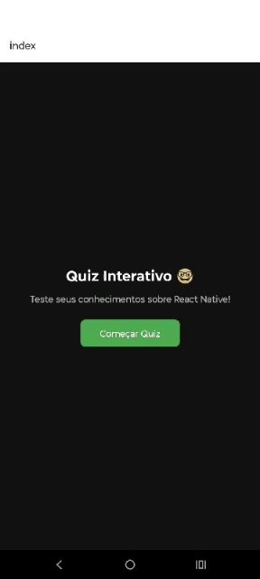

### 5 Separando questões e proximas perguntas

Vamos estrutura nossos próximos passos focado em um botao de próxima pergunta, com objetivo de organizar a estrutura do app para que fique pronta para múltiplas perguntas, mesmo que só tenhamos uma por enquanto.

Primeiramente vamos criar uma pasta "data" de dados e um arquivo questions.ts

```java
cv-onilne/
├── app/
│   ├── index.tsx         <- Tela principal (Vamos colocar o quiz-app aqui)
│   ├── _layout.tsx
│   ├── quiz.tsx
│   └── ...
├── component
│   ├── QuestionCard.tsx       <- comopnent a ser criado 
├── data
│   ├── questions.ts        <- comopnent a ser criado
└── ......
```

Dentro deste arquivo somente vamos colocar as nossas questões:

```tsx
// data/questions.ts
export const questions = [
  {
    text: 'Qual desses é um componente do React Native?',
    options: ['div', 'section', 'View', 'body'],
    correctAnswerIndex: 2,
  },
  {
    text: 'Qual hook usamos para gerenciar estado em um componente?',
    options: ['useFetch', 'useEvent', 'useState', 'useStyle'],
    correctAnswerIndex: 2,
  },
  {
    text: 'O que o Expo facilita no desenvolvimento?',
    options: ['Deploy em servidor', 'Acesso a recursos nativos', 'SEO', 'Ajuste de CSS'],
    correctAnswerIndex: 1,
  },
];
```

Vamos Atualizar QuestionCard.tsx para receber props
Vamos transformar QuestionCard em um componente reutilizável com props para:
- pergunta atual
- ir para próxima pergunta

Vamos realizar o seguinte ajuste no arquivo QuestionCard.tsx

```tsx
// components/QuestionCard.tsx
import React, { useEffect, useState } from 'react';
import { View, Text, TouchableOpacity, StyleSheet } from 'react-native';

type QuestionProps = {
  question: {
    text: string;
    options: string[];
    correctAnswerIndex: number;
  };
  onNext: () => void;
  isLast: boolean;
};

export default function QuestionCard({ question, onNext, isLast }: QuestionProps) {
  const [selectedOption, setSelectedOption] = useState<number | null>(null);

  const handleOptionPress = (index: number) => {
    if (selectedOption === null) {
      setSelectedOption(index);
    }
  };

    useEffect(() => {
    setSelectedOption(null); // reseta a seleção quando mudar a pergunta
  }, [question]);

  return (
    <View style={styles.card}>
      <Text style={styles.question}>{question.text}</Text>

      {question.options.map((option, index) => {
        const isSelected = selectedOption === index;
        const isCorrect = question.correctAnswerIndex === index;

        let backgroundColor = '#333';
        if (selectedOption !== null) {
          if (isSelected && isCorrect) backgroundColor = '#388e3c';
          else if (isSelected) backgroundColor = '#d32f2f';
        }

        return (
          <TouchableOpacity
            key={index}
            style={[styles.optionButton, { backgroundColor }]}
            onPress={() => handleOptionPress(index)}
            disabled={selectedOption !== null}
          >
            <Text style={styles.optionText}>
              {String.fromCharCode(65 + index)}. {option}
            </Text>
          </TouchableOpacity>
        );
      })}

      {selectedOption !== null && (
        <TouchableOpacity style={styles.nextButton} onPress={onNext}>
          <Text style={styles.nextText}>{isLast ? 'Finalizar Quiz' : 'Próxima Pergunta'}</Text>
        </TouchableOpacity>
      )}
    </View>
  );
}

const styles = StyleSheet.create({
  card: {
    backgroundColor: '#1e1e1e',
    borderRadius: 12,
    padding: 20,
  },
  question: {
    fontSize: 20,
    fontWeight: 'bold',
    marginBottom: 20,
    color: '#fff',
  },
  optionButton: {
    padding: 12,
    borderRadius: 8,
    marginBottom: 10,
  },
  optionText: {
    fontSize: 16,
    color: '#fff',
  },
  nextButton: {
    marginTop: 16,
    backgroundColor: '#4caf50',
    paddingVertical: 10,
    borderRadius: 8,
    alignItems: 'center',
  },
  nextText: {
    color: '#fff',
    fontSize: 16,
  },
});
```

<details>
<summary>🧠 O que o nosso arquivo novo faz:</summary>

---
📦 Importações

```tsx
import React, { useEffect, useState } from 'react';
import { View, Text, TouchableOpacity, StyleSheet } from 'react-native';
```
- Traz o React e o hook useState para controlar a resposta do usuário.
- Importa componentes de layout (View), texto (Text), botões (TouchableOpacity) e estilos (StyleSheet).

---

📘 Tipagem (TypeScript)

```tsx
type QuestionProps = {
  question: {
    text: string;
    options: string[];
    correctAnswerIndex: number;
  };
  onNext: () => void;
  isLast: boolean;
};

```
Define as propriedades esperadas para o componente QuestionCard:
- question: objeto com texto, opções e a resposta correta.
- onNext: função chamada ao clicar no botão "Próxima Pergunta".
- isLast: booleano que diz se essa é a última pergunta (muda o texto do botão final).


---
🧠 Componente Principal: QuestionCard

```tsx
export default function QuestionCard({ question, onNext, isLast }: QuestionProps) {
  const [selectedOption, setSelectedOption] = useState<number | null>(null);

```
- Componente recebe os dados da pergunta e controla internamente qual opção foi escolhida (selectedOption).

---

✅ Quando o usuário toca em uma opção

```tsx
const handleOptionPress = (index: number) => {
  if (selectedOption === null) {
    setSelectedOption(index);
  }
};

  useEffect(() => {
    setSelectedOption(null); // reseta a seleção quando mudar a pergunta
  }, [question]);
```
- Só permite que o usuário escolha uma vez.
- Ao mudar de pergunta, não mantem a opção selecionada ativa. 

---
🖼️ Interface visual da pergunta


```tsx
<View style={styles.card}>
  <Text style={styles.question}>{question.text}</Text>

```
- Exibe o texto da pergunta no topo da "cartinha"

---

---
🎯 Alternativas com cores de feedback

```tsx
{question.options.map((option, index) => {
  const isSelected = selectedOption === index;
  const isCorrect = question.correctAnswerIndex === index;

  let backgroundColor = '#333';
  if (selectedOption !== null) {
    if (isSelected && isCorrect) backgroundColor = '#388e3c';
    else if (isSelected) backgroundColor = '#d32f2f';
  }

```
- Verifica qual opção foi tocada.
- Muda a cor:
   - Verde se correta.
   - Vermelho se errada.
   - Cinza se ainda não foi tocada.


---
🧩 Botão de alternativa

```tsx
<TouchableOpacity
  key={index}
  style={[styles.optionButton, { backgroundColor }]}
  onPress={() => handleOptionPress(index)}
  disabled={selectedOption !== null}
>
  <Text style={styles.optionText}>
    {String.fromCharCode(65 + index)}. {option}
  </Text>
</TouchableOpacity>
```

- Cada opção vira um botão.
- Exibe como "A. View", "B. body", etc.
- Depois de escolher, os botões ficam desabilitados.
---


⏭️ Botão "Próxima Pergunta" ou "Finalizar Quiz"

```tsx
{selectedOption !== null && (
  <TouchableOpacity style={styles.nextButton} onPress={onNext}>
    <Text style={styles.nextText}>{isLast ? 'Finalizar Quiz' : 'Próxima Pergunta'}</Text>
  </TouchableOpacity>
)}
```
- Só aparece depois que o usuário escolheu uma resposta.
- Mostra:
   - "Próxima Pergunta" se ainda tiver mais.
   - "Finalizar Quiz" se for a última.

---

---
🎨 Estilos

- card: contêiner escuro com cantos arredondados.
- question: fonte maior, branca, para a pergunta.
- optionButton: botão de resposta com fundo dinâmico.
- optionText: texto branco e claro.
- nextButton: botão verde para seguir.
- nextText: texto branco do botão de próximo.


---

</details>

Posterior vamos adaptar o nosso quiz.tsx

```tsx
// app/quiz.tsx
import { View, StyleSheet } from 'react-native';
import { useState } from 'react';
import { questions } from '../data/questions';
import QuestionCard from '../components/QuestionCard';

export default function QuizScreen() {
  const [currentIndex, setCurrentIndex] = useState(0);

  const handleNext = () => {
    if (currentIndex < questions.length - 1) {
      setCurrentIndex(currentIndex + 1);
    } else {
      // Aqui no futuro vamos mostrar a tela de resultado
      alert('Você terminou o quiz! 😎');
    }
  };

  return (
    <View style={styles.container}>
      <QuestionCard
        question={questions[currentIndex]}
        onNext={handleNext}
        isLast={currentIndex === questions.length - 1}
      />
    </View>
  );
}

const styles = StyleSheet.create({
  container: {
    flex: 1,
    justifyContent: 'center',
    padding: 16,
    backgroundColor: '#121212',
  },
});

```

<details>
<summary>🧠 O que o nosso ajuste faz:</summary>

---

⏭️ 🧠 1. Controle do quiz


```tsx
const [currentIndex, setCurrentIndex] = useState(0);
```
- Cria um estado currentIndex que indica qual pergunta está sendo exibida.
- Começa com a primeira (índice 0).


```tsx
const handleNext = () => {
  if (currentIndex < questions.length - 1) {
    setCurrentIndex(currentIndex + 1); // Vai para a próxima pergunta
  } else {
    alert('Você terminou o quiz! 😎'); // Última pergunta: mostra mensagem
  }
};
```
- Função que avança para a próxima pergunta.
- Quando chega na última, mostra um alerta de "fim do quiz".

---

🧩 2. Renderização da pergunta atual

```tsx
<QuestionCard
  question={questions[currentIndex]}
  onNext={handleNext}
  isLast={currentIndex === questions.length - 1}
/>
```

- Usa o componente QuestionCard passando:
- A pergunta atual (questions[currentIndex])
- A função handleNext para o botão "Próxima"
- E um booleano isLast para saber se é a última pergunta

</details>

Com isto o resultado do nosso app até o  momento é o seguinte: 

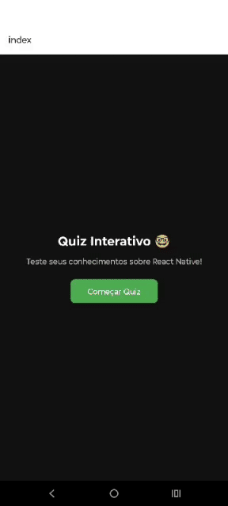

📌 Etapas seguintes:
- Criar o arquivo app/result.tsx com a tela de resultado
- Salvar a pontuação final no estado dentro de quiz.tsx
- Passar o score via router.push() para result.tsx
- Mostrar esse score na tela final


### 6 Vamos dar um resultado!

Vamos criar uma nova tela chamada /result, que será exibida quando o usuário terminar todas as perguntas.

Essa tela vai mostrar:
- Uma mensagem final divertida;
- A pontuação (ex: “Você acertou 2 de 3!”);
- Retornar o nosso jogador para a tela inicial


Primeiramente vamos criar o arquivo app/result.tsx com o seguinte conteudo:


```tsx
// app/result.tsx
import { View, Text, StyleSheet, TouchableOpacity } from 'react-native';
import { useRouter, useLocalSearchParams } from 'expo-router';

export default function ResultScreen() {
  const router = useRouter();
  const { score } = useLocalSearchParams(); // pega pontuação passada na rota

  const handleBackToStart = () => {
    router.replace('/'); // volta para a tela inicial
  };

  return (
    <View style={styles.container}>
      <Text style={styles.title}>Fim do Quiz! 🎉</Text>
      <Text style={styles.scoreText}>Você acertou {score} perguntas!</Text>
      <Text style={styles.motivation}>Mandou bem! 🚀</Text>

      <TouchableOpacity style={styles.button} onPress={handleBackToStart}>
        <Text style={styles.buttonText}>Voltar para o Início</Text>
      </TouchableOpacity>
    </View>
  );
}

const styles = StyleSheet.create({
  container: {
    flex: 1,
    backgroundColor: '#121212',
    justifyContent: 'center',
    alignItems: 'center',
    padding: 20,
  },
  title: {
    fontSize: 26,
    color: '#fff',
    fontWeight: 'bold',
    marginBottom: 20,
  },
  scoreText: {
    fontSize: 20,
    color: '#fff',
    marginBottom: 10,
  },
  motivation: {
    fontSize: 16,
    color: '#bbb',
    marginBottom: 30,
    textAlign: 'center',
  },
  button: {
    backgroundColor: '#4caf50',
    paddingVertical: 12,
    paddingHorizontal: 24,
    borderRadius: 8,
  },
  buttonText: {
    color: '#fff',
    fontSize: 16,
  },
});

```

<details>
<summary> Explicando o código acima:</summary>

Pegando o score da rota e função para retornar a tela inicial: 

```tsx
  const { score } = useLocalSearchParams(); // pega pontuação passada na rota

  const handleBackToStart = () => {
    router.replace('/'); // volta para a tela inicial
  };
```
Mensagem final de parabens por ter terminado o quiz e o botao de voltar:

```tsx
return (
    <View style={styles.container}>
      <Text style={styles.title}>Fim do Quiz! 🎉</Text>
      <Text style={styles.scoreText}>Você acertou {score} perguntas!</Text>
      <Text style={styles.motivation}>Mandou bem! 🚀</Text>

      <TouchableOpacity style={styles.button} onPress={handleBackToStart}>
        <Text style={styles.buttonText}>Voltar para o Início</Text>
      </TouchableOpacity>
    </View>
  );
```

E o final como sempre, estilos, muitos estilos.

</details>

Agora vamos atualizar o nosso arquivo quiz.tsx com o seguinte código:

```tsx
// app/quiz.tsx
import { View, StyleSheet } from 'react-native';
import { useState } from 'react';
import { questions } from '../data/questions';
import QuestionCard from '../components/QuestionCard';
import { useRouter } from 'expo-router';

export default function QuizScreen() {
  const [currentIndex, setCurrentIndex] = useState(0);
  const [score, setScore] = useState(0);
  const router = useRouter();

  const handleAnswer = (isCorrect: boolean) => {
    if (isCorrect) {
      setScore(prev => prev + 1);
    }
  };

  const handleNext = () => {
    if (currentIndex < questions.length - 1) {
      setCurrentIndex(currentIndex + 1);
    } else {
        router.replace({
            pathname: '/result',
            params: {
              score: score.toString(),              
            },
          });
    }
  };

  return (
    <View style={styles.container}>
      <QuestionCard
        question={questions[currentIndex]}
        onNext={handleNext}
        isLast={currentIndex === questions.length - 1}
        onAnswer={handleAnswer}
      />
    </View>
  );
}

const styles = StyleSheet.create({
  container: {
    flex: 1,
    justifyContent: 'center',
    padding: 16,
    backgroundColor: '#121212',
  },
});

```

<details>
<summary>O que o nosso código acima faz? </summary>

---

✅ 1. Controle de pontuação

```tsx
const [score, setScore] = useState(0);
```
- Novo estado para guardar a pontuação do usuário.

---

✅ 2. Navegação com expo-router

```tsx
import { useRouter } from 'expo-router';
const router = useRouter();
```

- Adiciona navegação para outra tela (ex: resultado).

---

✅ 3. Função handleAnswer


```tsx
const handleAnswer = (isCorrect: boolean) => {
  if (isCorrect) {
    setScore(prev => prev + 1);
  }
};
```

- Nova função para contar ponto se a resposta estiver correta.

---
✅ 4. Navegação para a tela de resultado

```tsx
router.replace({
  pathname: '/result',
  params: {
    score: score.toString(),
    total: questions.length.toString(),
  },
});
```

- Ao finalizar o quiz, redireciona para a tela de resultado, enviando os dados via params.

✅ 5. Prop extra no componente QuestionCard

```tsx
onAnswer={handleAnswer}
```
- Passa a função onAnswer como nova prop para que o QuestionCard possa chamar quando o usuário responder.

</details>

Posterior ajustamos o question card, onde pegamos a pergunta e validamos se a mesma esta correta ou não:

```tsx
// components/QuestionCard.tsx
type QuestionProps = {
  question: {
    text: string;
    options: string[];
    correctAnswerIndex: number;
  };
  onNext: () => void;
  isLast: boolean;
  onAnswer: (isCorrect: boolean) => void; // nova prop
};

export default function QuestionCard({ question, onNext, isLast, onAnswer }: QuestionProps) {
  const [selectedOption, setSelectedOption] = useState<number | null>(null);

  const handleOptionPress = (index: number) => {
    if (selectedOption === null) {
      setSelectedOption(index);
      const isCorrect = index === question.correctAnswerIndex;
      onAnswer(isCorrect); // dispara se acertou ou não
    }
  };

  useEffect(() => {
    setSelectedOption(null);
  }, [question]);

  // ... (resto do código permanece igual)
}

```

Até o momento a nossa aplicação está assim: 

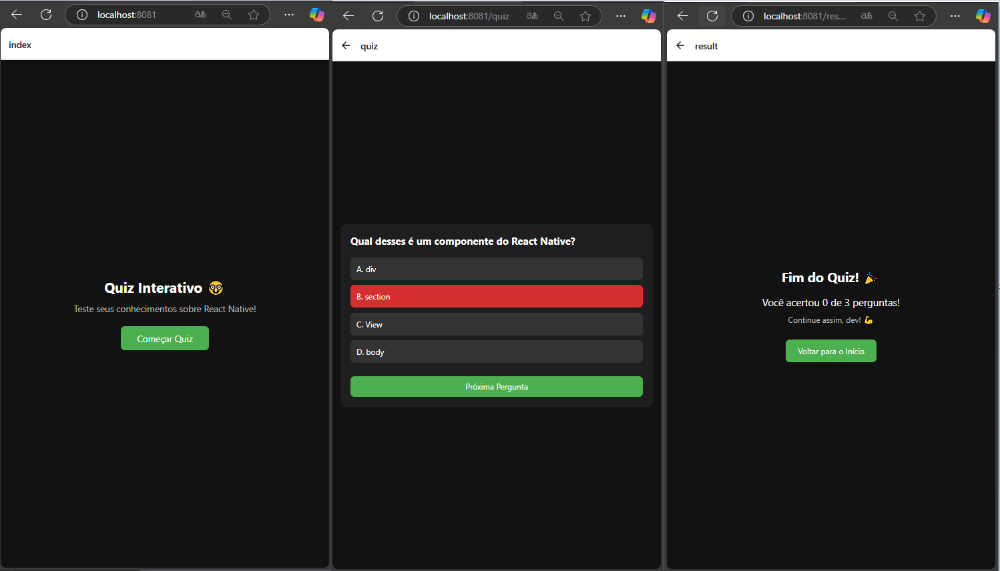

### 7 - Score

Vamos adicionar um score simples para quem está respondendo para se motivar com os seguintes niveis:

- 'Você é o mestre supremo do React Native! 👑'
- 'Nada mal, jovem padawan! ✨'
- 'Hmm... bora estudar mais um pouco? 📚'

Para isto realizamos os segunintes ajustes:

---
📦 1. Atualize quiz.tsx para enviar também o total:

```tsx
router.replace({
  pathname: '/result',
  params: {
    score: score.toString(),
    total: questions.length.toString(), // <- adiciona o total
  },
});

```
🎯 2. Atualize result.tsx para exibir “X de Y”

```tsx
// app/result.tsx
import { View, Text, StyleSheet, TouchableOpacity } from 'react-native';
import { useRouter, useLocalSearchParams } from 'expo-router';

export default function ResultScreen() {
  const router = useRouter();
  const { score, total } = useLocalSearchParams(); // recebe score e total

  const handleBackToStart = () => {
    router.replace('/');
  };

  return (
    <View style={styles.container}>
      <Text style={styles.title}>Fim do Quiz! 🎉</Text>
      <Text style={styles.scoreText}>
        Você acertou {score} de {total} perguntas!
      </Text>
      <Text style={styles.motivation}>Continue assim, dev! 💪</Text>

      <Text style={styles.message}>
        {Number(score) === Number(total)
          ? 'Você é o mestre supremo do React Native! 👑'
          : Number(score) > Number(total) / 2
          ? 'Nada mal, jovem padawan! ✨'
          : 'Hmm... bora estudar mais um pouco? 📚'}
      </Text>

      <TouchableOpacity style={styles.button} onPress={handleBackToStart}>
        <Text style={styles.buttonText}>Voltar para o Início</Text>
      </TouchableOpacity>
    </View>
  );
}

// Se mantem os estilos e adicionamos a mensagem

message: {
    fontSize: 16,
    color: '#ccc',
    textAlign: 'center',
    marginBottom: 32,
  },
```

Com isto o nosso app fica com uma cara diferente: 
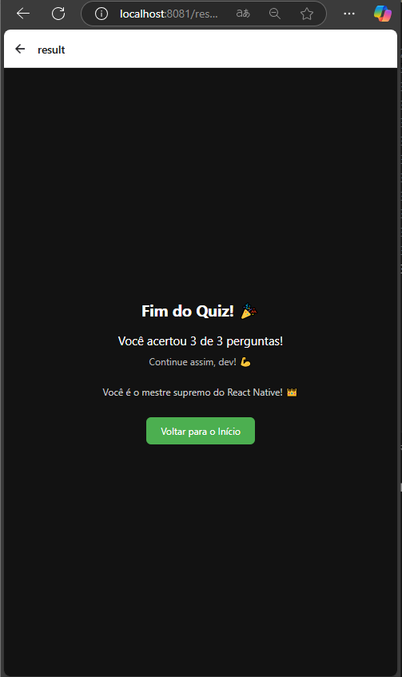

### 8 - Criando uma intrgração com IA

Vamos criar uma integração com IA. Para isto precisamos criar uma chave para podermos direcionar questionamentos através desta API.

Para criarmos a chave seguimos os passos abaixo:

- Crie uma conta em https://openrouter.ai
- Vá até https://openrouter.ai/keys e gere sua API Key.
- Guarde a sua sua key , pois vamos usar ela no campo "SUA_API_KEY_AQUI" no código a seguir.

A chave é intransferivel e nao deve ser compartilhada ou feito o upload da mesma para o github. 


Vamos criar o seguinte diretório services/QuestionService.ts e vamos adicionar o código abaixo: 


```tsx
// services/QuestionService.ts

const OPENROUTER_API_KEY = 'Aqui vai sua chave';

export class QuestionService {
  static fetchQuestions() {
    throw new Error('Method not implemented.');
  }
  static async fetchQuestionFromOpenAI() {
    const response = await fetch('https://openrouter.ai/api/v1/chat/completions', {
      method: 'POST',
      headers: {
        'Authorization': `Bearer ${OPENROUTER_API_KEY}`,
        'Content-Type': 'application/json',
        'HTTP-Referer': 'https://seu-site-ou-projeto.com',
        'X-Title': 'SlotMachineEducativo',
      },
      body: JSON.stringify({
        model: 'mistralai/mistral-7b-instruct',
        messages: [
          {
            role: 'user',
            content: `Gere 25 perguntas de múltipla escolha em português sobre história do Brasil no seguinte formato JSON:
  [
    {
      "text": "Qual foi o ano da Independência do Brasil?",
      "options": ["1822", "1889", "1500", "1808"],
      "correctAnswerIndex": 0
    },
    ...
  ]`
          }
        ]
      }),
    });
  
    const data = await response.json();
    const rawContent = data.choices?.[0]?.message?.content;
    const jsonMatch = rawContent?.match(/\[[\s\S]*\]/); // extrai o array JSON
  
    if (!jsonMatch) {
      throw new Error('JSON inválido ou não encontrado.');
    }
  
    return JSON.parse(jsonMatch[0]);
  }
}

```

<details>
<summary>Explicando o código acima: </summary>

---

Aqui vai a chave de API que geramos

```tsx
const OPENROUTER_API_KEY = 'Aqui vai sua chave';
```

Aqui ocorre a chamada para API com um questionamento especifico onde nos é retornado um json com 25 respostas, para utilizarmos no futuro. 

```tsx
static async fetchQuestionFromOpenAI() {
    const response = await fetch('https://openrouter.ai/api/v1/chat/completions', {
      method: 'POST',
      headers: {
        'Authorization': `Bearer ${OPENROUTER_API_KEY}`,
        'Content-Type': 'application/json',
        'HTTP-Referer': 'https://seu-site-ou-projeto.com',
        'X-Title': 'SlotMachineEducativo',
      },
      body: JSON.stringify({
        model: 'mistralai/mistral-7b-instruct',
        messages: [
          {
            role: 'user',
            content: `Gere 25 perguntas de múltipla escolha em português sobre história do Brasil no seguinte formato JSON:
  [
    {
      "text": "Qual foi o ano da Independência do Brasil?",
      "options": ["1822", "1889", "1500", "1808"],
      "correctAnswerIndex": 0
    },
    ...
  ]`
          }
        ]
      }),
    });
```

Aqui exportamos as questões geradas no formato de json:

```tsx
const data = await response.json();
    const rawContent = data.choices?.[0]?.message?.content;
    const jsonMatch = rawContent?.match(/\[[\s\S]*\]/); // extrai o array JSON
  
    if (!jsonMatch) {
      throw new Error('JSON inválido ou não encontrado.');
    }
  
    return JSON.parse(jsonMatch[0]);
  }
```

Lembrando que tudo isto somente vai ocorrer quando alguém chamar este serviço. 


---
</details>


### 9 - Testando a serviço diretamente em Produção ehheeh

O que vamos fazer a seguir é pegar todas as perguntas e pegar as 3 primeira para serem utilizadas no nosso questionario. 

<details>
<summary>Lembrando que o prompt que temos de momento é o seguinte: </summary>

```tsx
messages: [
          {
            role: 'user',
            content: `Gere 25 perguntas de múltipla escolha em português sobre história do Brasil no seguinte formato JSON:
  [
    {
      "text": "Qual foi o ano da Independência do Brasil?",
      "options": ["1822", "1889", "1500", "1808"],
      "correctAnswerIndex": 0
    },
    ...
  ]`
          }
        ]
```

Nao esquecam, se o prompt estiver mal formatado vai dar erro ao chamar a servioçe e tentar consumir as perguntas

</details>

---
Dentro do nosso arquivo data/questions.ts, vamos subistituir as nossas perguntas fixas pela chamada do serviço, com o seguinte comando: 

```tsx
// data/questions.ts
import { QuestionService } from '../services/QuestionService';

export async function loadQuestions() {
  const allQuestions = await QuestionService.fetchQuestionFromOpenAI();
  return allQuestions.slice(0, 3); // pega só as 3 primeiras
}
```

✅ Em resumo:
No lugar de exportar perguntas fixas, vamos exportar uma função loadQuestions() que chama a API e retorna as 3 primeiras perguntas do array

---

Vamos adaptar o QuizScreen, para carregar as perguntas que estão retornando dinamicamente, atualizando o app/quiz.tsx:


```tsx
import { View, StyleSheet, ActivityIndicator } from 'react-native';
import { useEffect, useState } from 'react';
import { loadQuestions } from '../data/questions';
import QuestionCard from '../components/QuestionCard';
import { useRouter } from 'expo-router';

export default function QuizScreen() {
  const [questions, setQuestions] = useState<any[]>([]);
  const [currentIndex, setCurrentIndex] = useState(0);
  const [score, setScore] = useState(0);
  const [loading, setLoading] = useState(true);
  const router = useRouter();

  useEffect(() => {
    (async () => {
      const loaded = await loadQuestions();
      setQuestions(loaded);
      setLoading(false);
    })();
  }, []);

  const handleAnswer = (isCorrect: boolean) => {
    if (isCorrect) {
      setScore(prev => prev + 1);
    }
  };

  const handleNext = () => {
    if (currentIndex < questions.length - 1) {
      setCurrentIndex(currentIndex + 1);
    } else {
      router.replace({
        pathname: '/result',
        params: {
          score: score.toString(),
          total: questions.length.toString(),
        },
      });
    }
  };

  if (loading) {
    return (
      <View style={styles.container}>
        <ActivityIndicator size="large" color="#fff" />
      </View>
    );
  }

  return (
    <View style={styles.container}>
      <QuestionCard
        question={questions[currentIndex]}
        onNext={handleNext}
        isLast={currentIndex === questions.length - 1}
        onAnswer={handleAnswer}
      />
    </View>
  );
}

const styles = StyleSheet.create({
  container: {
    flex: 1,
    justifyContent: 'center',
    padding: 16,
    backgroundColor: '#121212',
  },
});

```

<details>
<summary>Entendendo o que o código acima entrega</summary>

---

📦 1. Importações

```tsx
import { loadQuestions } from '../data/questions';
```
- Importa uma função loadQuestions() — que carrega as perguntas dinamicamente (do serviço criado).

---

🔄 2. Estado das Perguntas

```tsx
const [questions, setQuestions] = useState<any[]>([]);
const [currentIndex, setCurrentIndex] = useState(0);
const [score, setScore] = useState(0);
const [loading, setLoading] = useState(true);
```
São adicionados dois estados:
- questions: para armazenar as perguntas carregadas dinamicamente.
- loading: para controlar se ainda está carregando os dados vindos do serviço.

---

---

⚙️ 3. useEffect para carregar dados

```tsx
useEffect(() => {
  (async () => {
    const loaded = await loadQuestions();
    setQuestions(loaded);
    setLoading(false);
  })();
}, []);
```
- O useEffect chama loadQuestions() assim que o componente é montado.
- Atualiza questions e marca loading como false. (Deixa de girar o nosso circulo, esperando as questões serem carregadas)

---

🌀 4. Tratamento de carregamento

```tsx
if (loading) {
  return (
    <View style={styles.container}>
      <ActivityIndicator size="large" color="#fff" />
    </View>
  );
}
```
- Enquanto loading é true, o componente mostra um indicador de carregamento (ActivityIndicator) ao invés do conteúdo principal.

---


</details>


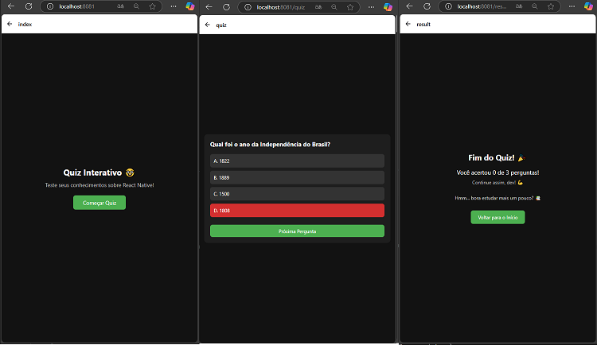

### 10 - Criando parametros

Nesta tópico vamos criar alguns parametros para o quiz ficar mais interativo

Vammos criar um componente para gerenciar essas opções. Este componente vai receber opções de tempo e de conteudo, mostrando em tela. Poderemos somente escolher uma opção de quantidade de pergutnas e um conteudo por vêz. 

```tsx
['História do Brasil', 'Língua Portuguesa', 'Matemática', 'Geografia', 'Naruto', 'Pirata que Estica']; //conteudo
[5, 10, 15];// quantidade de perguntas
```

Vamos criar o nosso componente components/OptionSelector.tsx e inserir o seguinte código dentro: 

---
```tsx
// components/OptionSelector.tsx
// components/OptionSelector.tsx
import { View, Text, TouchableOpacity, StyleSheet } from 'react-native';

interface OptionSelectorProps<T> {
  title: string;
  options: T[];
  selected: T;
  onSelect: (value: T) => void;
  renderLabel?: (item: T) => string; // para personalizar como o texto aparece
}

export function OptionSelector<T extends string | number>({
  title,
  options,
  selected,
  onSelect,
  renderLabel = (item) => String(item),
}: OptionSelectorProps<T>) {
  return (
    <View style={styles.wrapper}>
      <Text style={styles.sectionTitle}>{title}</Text>
      <View style={styles.buttonGroup}>
        {options.map((item) => (
          <TouchableOpacity
            key={String(item)}
            style={[
              styles.selectButton,
              selected === item && styles.selectedButton,
            ]}
            onPress={() => onSelect(item)}
          >
            <Text style={styles.selectButtonText}>{renderLabel(item)}</Text>
          </TouchableOpacity>
        ))}
      </View>
    </View>
  );
}

const styles = StyleSheet.create({
  wrapper: {
    marginBottom: 16,
  },
  title: {
    fontSize: 28,
    fontWeight: 'bold',
    marginBottom: 12,
    color: '#fff', // texto branco
  },
  sectionTitle: {
    fontSize: 16,
    color: '#ccc',
    marginTop: 16,
    marginBottom: 8,
    textAlign: 'center',
  },
  buttonGroup: {
    flexDirection: 'row',
    flexWrap: 'wrap',
    justifyContent: 'center',
  },
  selectButton: {
    backgroundColor: '#333',
    paddingVertical: 10,
    paddingHorizontal: 14,
    borderRadius: 8,
    margin: 6,
  },
  selectedButton: {
    backgroundColor: '#4caf50',
  },
  selectButtonText: {
    color: '#fff',
    fontSize: 14,
  },
});


```

De forma resumida este componente gera um botao com os parametros passados. 

---

Agora vamos ajustar o nosso index com as nossas opções:

```tsx
// app/index.tsx
import { View, Text, StyleSheet, TouchableOpacity } from 'react-native';
import { useRouter } from 'expo-router';
import { useState } from 'react';
import { OptionSelector } from '@/components/OptionSelector';

const categories = ['História do Brasil', 'Língua Portuguesa', 'Matemática', 'Geografia', 'Naruto', 'Pirata que Estica'];
const questionCounts = [5, 10, 15];

export default function HomeScreen() {
  const router = useRouter();

  const [selectedCategory, setSelectedCategory] = useState<string>('História do Brasil');
  const [selectedCount, setSelectedCount] = useState<number>(5);

  const startQuiz = () => {
    router.push('/quiz');
  };

  return (
    <View style={styles.container}>
      <Text style={styles.title}>Quiz Interativo 🤓</Text>
      <Text style={styles.subtitle}>Escolha o tema e quantidade de perguntas:</Text>

      <View style={styles.separator} />
      <OptionSelector
        title="Tema"
        options={categories}
        selected={selectedCategory}
        onSelect={setSelectedCategory}
      />
      <View style={styles.separator} />
      <OptionSelector
        title="Número de Perguntas"
        options={questionCounts}
        selected={selectedCount}
        onSelect={setSelectedCount}
        renderLabel={(n) => `${n} questões`}
      />
      <View style={styles.separator} />
      <TouchableOpacity style={styles.button} onPress={startQuiz}>
        <Text style={styles.buttonText}>Começar Quiz</Text>
      </TouchableOpacity>
    </View>
  );
}


const styles = StyleSheet.create({
  container: {
    flex: 1,
    backgroundColor: '#121212', // fundo preto
    alignItems: 'center',
    justifyContent: 'center',
    padding: 16,
  },
  title: {
    fontSize: 28,
    fontWeight: 'bold',
    marginBottom: 12,
    color: '#fff', // texto branco
  },
  subtitle: {
    fontSize: 18,
    color: '#bbb', // cinza claro
    marginBottom: 24,
    textAlign: 'center',
  },
  button: {
    backgroundColor: '#4caf50',
    paddingVertical: 12,
    paddingHorizontal: 32,
    borderRadius: 8,
  },
  buttonText: {
    color: '#fff',
    fontSize: 18,
  },
  separator: {
    height: 1,
    width: '80%',
    backgroundColor: '#333',
    marginVertical: 20,
  },
});
```

Analisando de forma resumida os ajustes são as opções que vamos inserir e os compoenntes passando os parametros para a sua construção:


```tsx
const categories = ['História do Brasil', 'Língua Portuguesa', 'Matemática'];
const questionCounts = [5, 10, 15];
```

```tsx
return (
    <View style={styles.container}>
      <Text style={styles.title}>Quiz Interativo 🤓</Text>
      <Text style={styles.subtitle}>Escolha o tema e quantidade de perguntas:</Text>

      <OptionSelector
        title="Tema"
        options={categories}
        selected={selectedCategory}
        onSelect={setSelectedCategory}
      />

      <OptionSelector
        title="Número de Perguntas"
        options={questionCounts}
        selected={selectedCount}
        onSelect={setSelectedCount}
        renderLabel={(n) => `${n} questões`}
      />

      <TouchableOpacity style={styles.button} onPress={startQuiz}>
        <Text style={styles.buttonText}>Começar Quiz</Text>
      </TouchableOpacity>
    </View>
  );
```

Observação: também adicionamos uma linha separadora, para o conteudo ficar mais organizado: 

```tsx
<View style={styles.separator} />
```

Ao final, temos o seguinte resultado:

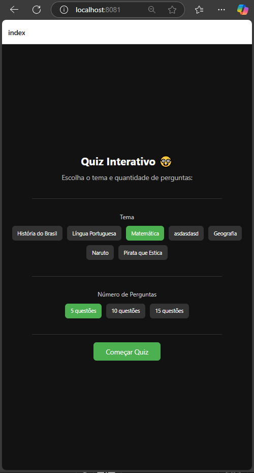

### 11 - Passando parametros para o serviço. 

Agora vamos adaptar a nossa serviçe para receber esses parametros.

A adaptação para parametros é simples. Vamos focar primeiramente no nosso arquivo services/QuestionService.ts e no nosso arquivo data/questions.ts

Dentro da nossa service vamos realizar os seguintes ajutes: 

Receber parametros na chamada da service
```tsx
static async fetchQuestionFromOpenAI(category: string, count: number)
```

Adaptar a nossa solicitação para a api de IA:
Reparem no código abaixo, simplismente adiconamos as nossas variaveis ao texto, isto funciona como se estivessemos em um agente de IA solicitando o texto abaixo, porém com parametros que vamos pedir em tela.

```tsx
messages: [
          {
            role: 'user',
            content: `Gere ${count} perguntas de múltipla escolha em português sobre o conteudo ${category} no seguinte formato JSON:
  [
    {
      "text": "Qual foi o ano da Independência do Brasil?",
      "options": ["1822", "1889", "1500", "1808"],
      "correctAnswerIndex": 0
    },
    ...
  ]`
          }
```


Posterior vamos ajeitar a nossa tela de questões simplismente adaptando para que a chamada receba os parametros e direcione para o retorno da serviçe. 

```tsx
import { QuestionService } from '../services/QuestionService';

export async function loadQuestions(category: string, count: number) {
  const allQuestions = await QuestionService.fetchQuestionFromOpenAI(category, count);
  return allQuestions.slice(0, 3); // pega só as 3 primeiras
}
```

<details>
<summary>Códigos completo da nossa service:<summary>

```tsx
// services/QuestionService.ts

const OPENROUTER_API_KEY = 'sua chave aqui';

export class QuestionService {
  static fetchQuestions() {
    throw new Error('Method not implemented.');
  }
  static async fetchQuestionFromOpenAI(category: string, count: number) {
    const response = await fetch('https://openrouter.ai/api/v1/chat/completions', {
      method: 'POST',
      headers: {
        'Authorization': `Bearer ${OPENROUTER_API_KEY}`,
        'Content-Type': 'application/json',
        'HTTP-Referer': 'https://seu-site-ou-projeto.com',
        'X-Title': 'SlotMachineEducativo',
      },
      body: JSON.stringify({
        model: 'mistralai/mistral-7b-instruct',
        messages: [
          {
            role: 'user',
            content: `Gere ${count} perguntas de múltipla escolha em português sobre o conteudo ${category} no seguinte formato JSON:
  [
    {
      "text": "Qual foi o ano da Independência do Brasil?",
      "options": ["1822", "1889", "1500", "1808"],
      "correctAnswerIndex": 0
    },
    ...
  ]`
          }
        ]
      }),
    });
  
    const data = await response.json();
    const rawContent = data.choices?.[0]?.message?.content;
    const jsonMatch = rawContent?.match(/\[[\s\S]*\]/); // extrai o array JSON
  
    if (!jsonMatch) {
      throw new Error('JSON inválido ou não encontrado.');
    }
  
    return JSON.parse(jsonMatch[0]);
  }
}

```

</details>

### 12 - Arrumando o fluxo

Agora vamos arrumar o nosso fluxo para que selecionemos alguns valores e direcionemos eles para chegar na nossa service. Para isto vamos ajustar os seguintes arquivos: 

- index.tsx
- quiz.tsx

O fluxo vai ser simples, vamos receber o que o nosso user digitou e mandar para o quiz e o quiz vai mandar para a nossa data que vai mandar para a nossa service. 


O nosso index vai funcionar da seguinte maneira: 

Vamos mudar a nossa função de rota quiz para passar dois parametros. Estes dois parametros é o que o nosso usuário selecionou. 

```tsx
const startQuiz = () => {
    router.push({
      pathname: '/quiz',
      params: {
        selectedCategory,
        selectedCount: selectedCount.toString(), // transforma número em string
      },
    });
  };
```

Se formos analizar o sistema ja começa com o seguinte fluxo de opções:

```tsx
  const [selectedCategory, setSelectedCategory] = useState<string>('História do Brasil');
  const [selectedCount, setSelectedCount] = useState<number>(5);
```

Entao se nao selecionarmos nada, olhamos para estes parametros.

<details>
<summary>Nosso index completo:</summary>

```tsx
// app/index.tsx
import { View, Text, StyleSheet, TouchableOpacity } from 'react-native';
import { useRouter } from 'expo-router';
import { useState } from 'react';
import { OptionSelector } from '@/components/OptionSelector';

const categories = ['História do Brasil', 'Língua Portuguesa', 'Matemática', 'Geografia', 'Naruto', 'Pirata que Estica'];
const questionCounts = [5, 10, 15];

export default function HomeScreen() {
  const router = useRouter();
  const [selectedCategory, setSelectedCategory] = useState<string>('História do Brasil');
  const [selectedCount, setSelectedCount] = useState<number>(5);


  const startQuiz = () => {
    router.push({
      pathname: '/quiz',
      params: {
        selectedCategory,
        selectedCount: selectedCount.toString(), // transforma número em string
      },
    });
  };

  return (
    <View style={styles.container}>
      <Text style={styles.title}>Quiz Interativo 🤓</Text>
      <Text style={styles.subtitle}>Escolha o tema e quantidade de perguntas:</Text>

      <View style={styles.separator} />
      <OptionSelector
        title="Tema"
        options={categories}
        selected={selectedCategory}
        onSelect={setSelectedCategory}
      />
      <View style={styles.separator} />
      <OptionSelector
        title="Número de Perguntas"
        options={questionCounts}
        selected={selectedCount}
        onSelect={setSelectedCount}
        renderLabel={(n) => `${n} questões`}
      />
      <View style={styles.separator} />
      <TouchableOpacity style={styles.button} onPress={startQuiz}>
        <Text style={styles.buttonText}>Começar Quiz</Text>
      </TouchableOpacity>
    </View>
  );
}


const styles = StyleSheet.create({
  container: {
    flex: 1,
    backgroundColor: '#121212', // fundo preto
    alignItems: 'center',
    justifyContent: 'center',
    padding: 16,
  },
  title: {
    fontSize: 28,
    fontWeight: 'bold',
    marginBottom: 12,
    color: '#fff', // texto branco
  },
  subtitle: {
    fontSize: 18,
    color: '#bbb', // cinza claro
    marginBottom: 24,
    textAlign: 'center',
  },
  button: {
    backgroundColor: '#4caf50',
    paddingVertical: 12,
    paddingHorizontal: 32,
    borderRadius: 8,
  },
  buttonText: {
    color: '#fff',
    fontSize: 18,
  },
  separator: {
    height: 1,
    width: '80%',
    backgroundColor: '#333',
    marginVertical: 20,
  },
});
```

</details>

Posterior vamos ajustar no nosso fluxo do quiz. Nesta etapa, realizamos poucos ajustes, pegar o que foi selecionado e mandar para o serviço gerar os dados:


Dentro do nosso usefect, pegamos o que vem na nossa const do uselocalSearchParams() e adicionamos ao nosso loadQuestions que posterior chama o nosso serviço com os parametros. 
```tsx
export default function QuizScreen() {
  const [questions, setQuestions] = useState<any[]>([]);
  const [currentIndex, setCurrentIndex] = useState(0);
  const [score, setScore] = useState(0);
  const [loading, setLoading] = useState(true);
  const router = useRouter();
  const { selectedCategory, selectedCount } = useLocalSearchParams();

  const category = selectedCategory as string;
  const count = parseInt(selectedCount as string);

  console.log('Categoria:', category); // 
  console.log('Número de perguntas:', count);//

  useEffect(() => {
    (async () => {
      const loaded = await loadQuestions(category, count);
      setQuestions(loaded);
      setLoading(false);
    })();
  }, []);
```

Com o código abaixo é possível ver via console log o que foi selecionado

```tsx
  console.log('Categoria:', category); // 
  console.log('Número de perguntas:', count);//
```

<details>
<summary>Nosso quiz completo:</summary>

```tsx
import { View, StyleSheet, ActivityIndicator } from 'react-native';
import { useEffect, useState } from 'react';
import { loadQuestions } from '../data/questions';
import QuestionCard from '../components/QuestionCard';
import { useRouter } from 'expo-router';
import { useLocalSearchParams } from 'expo-router';

export default function QuizScreen() {
  const [questions, setQuestions] = useState<any[]>([]);
  const [currentIndex, setCurrentIndex] = useState(0);
  const [score, setScore] = useState(0);
  const [loading, setLoading] = useState(true);
  const router = useRouter();
  const { selectedCategory, selectedCount } = useLocalSearchParams();

  const category = selectedCategory as string;
  const count = parseInt(selectedCount as string);

  console.log('Categoria:', category);
  console.log('Número de perguntas:', count);

  useEffect(() => {
    (async () => {
      const loaded = await loadQuestions(category, count);
      setQuestions(loaded);
      setLoading(false);
    })();
  }, []);

  const handleAnswer = (isCorrect: boolean) => {
    if (isCorrect) {
      setScore(prev => prev + 1);
    }
  };

  const handleNext = () => {
    if (currentIndex < questions.length - 1) {
      setCurrentIndex(currentIndex + 1);
    } else {
      router.replace({
        pathname: '/result',
        params: {
          score: score.toString(),
          total: questions.length.toString(),
        },
      });
    }
  };

  if (loading) {
    return (
      <View style={styles.container}>
        <ActivityIndicator size="large" color="#fff" />
      </View>
    );
  }

  return (
    <View style={styles.container}>
      <QuestionCard
        question={questions[currentIndex]}
        onNext={handleNext}
        isLast={currentIndex === questions.length - 1}
        onAnswer={handleAnswer}
      />
    </View>
  );
}

const styles = StyleSheet.create({
  container: {
    flex: 1,
    justifyContent: 'center',
    padding: 16,
    backgroundColor: '#121212',
  },
});

```

</details>

Como ficou nosso software até o momento: 

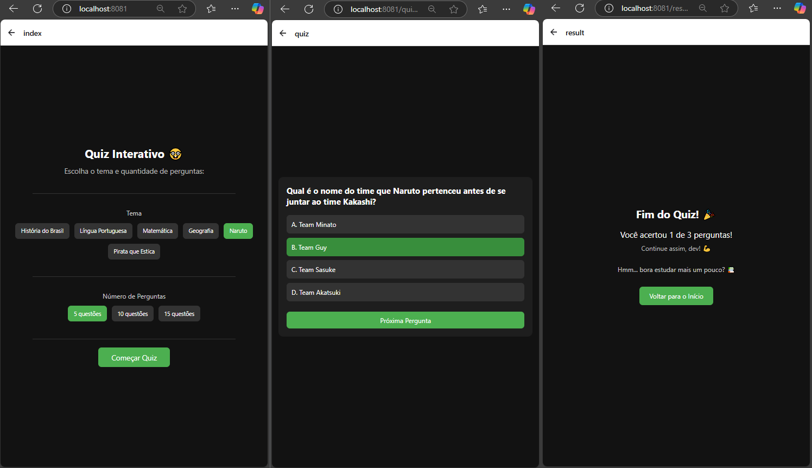

### 13 Selecionando Player e melhorando loading.

Nesta etapa vamos pegar o nome do jogador antes de o jogo começar para no futuro gravarmos no Ranking. Também vamos colocar uma mensagem de load ao carregar as perguntas, para ficar melhor o fluxo para quem for jogar. 

Para isto vamos criar um Textinput e passar a informação para a próxima página que é o nosso quiz.

No nosso código realizamos poucos ajustes (Comentarios explicando as alterações): 

```tsx
//Atualizamos a importação para podermos utilizar o textinput
import { View, Text, StyleSheet, TouchableOpacity, TextInput } from 'react-native'; 


// Atualizamos o direcionamento para o quiz e caso nao tenha nome digitaod nao deixa ir adiante
const startQuiz = () => {
    if (!playerName.trim()) {
      alert("Por favor, digite seu nome.");
      return;
    }

    router.push({
      pathname: '/quiz',
      params: {
        name: playerName,
        selectedCategory,
        selectedCount: selectedCount.toString(),
      },
    });
  };


// Adicionamos o input para pedir o nome do players:

<TextInput
        style={styles.input}
        placeholder="Seu nome"
        placeholderTextColor="#888"
        value={playerName}
        onChangeText={setPlayerName}
      />


// Adicionaoms o titulos: 

 input: {
    width: '80%',
    borderWidth: 1,
    borderColor: '#444',
    borderRadius: 8,
    paddingHorizontal: 16,
    paddingVertical: 10,
    color: '#fff',
    fontSize: 16,
    marginBottom: 24,
  },
```

<details>

<summary>Nosso código index completo:</summary>

```tsx
// app/index.tsx
import { View, Text, StyleSheet, TouchableOpacity, TextInput } from 'react-native';
import { useRouter } from 'expo-router';
import { useState } from 'react';
import { OptionSelector } from '@/components/OptionSelector';

const categories = ['História do Brasil', 'Língua Portuguesa', 'Matemática', 'Geografia', 'Naruto', 'Pirata que Estica'];
const questionCounts = [5, 10, 15];

export default function HomeScreen() {
  const router = useRouter();
  const [playerName, setPlayerName] = useState('');
  const [selectedCategory, setSelectedCategory] = useState<string>('História do Brasil');
  const [selectedCount, setSelectedCount] = useState<number>(5);

  const startQuiz = () => {
    if (!playerName.trim()) {
      alert("Por favor, digite seu nome.");
      return;
    }

    router.push({
      pathname: '/quiz',
      params: {
        name: playerName,
        selectedCategory,
        selectedCount: selectedCount.toString(),
      },
    });
  };

  return (
    <View style={styles.container}>
      <Text style={styles.title}>Quiz Interativo 🤓</Text>
      <Text style={styles.subtitle}>Digite seu nome:</Text>
      <TextInput
        style={styles.input}
        placeholder="Seu nome"
        placeholderTextColor="#888"
        value={playerName}
        onChangeText={setPlayerName}
      />

      <Text style={styles.subtitle}>Escolha o tema e quantidade de perguntas:</Text>

      <View style={styles.separator} />
      <OptionSelector
        title="Tema"
        options={categories}
        selected={selectedCategory}
        onSelect={setSelectedCategory}
      />
      <View style={styles.separator} />
      <OptionSelector
        title="Número de Perguntas"
        options={questionCounts}
        selected={selectedCount}
        onSelect={setSelectedCount}
        renderLabel={(n) => `${n} questões`}
      />
      <View style={styles.separator} />
      <TouchableOpacity style={styles.button} onPress={startQuiz}>
        <Text style={styles.buttonText}>Começar Quiz</Text>
      </TouchableOpacity>
    </View>
  );
}

const styles = StyleSheet.create({
  container: {
    flex: 1,
    backgroundColor: '#121212',
    alignItems: 'center',
    justifyContent: 'center',
    padding: 16,
  },
  title: {
    fontSize: 28,
    fontWeight: 'bold',
    marginBottom: 12,
    color: '#fff',
  },
  subtitle: {
    fontSize: 18,
    color: '#bbb',
    marginBottom: 12,
    textAlign: 'center',
  },
  input: {
    width: '80%',
    borderWidth: 1,
    borderColor: '#444',
    borderRadius: 8,
    paddingHorizontal: 16,
    paddingVertical: 10,
    color: '#fff',
    fontSize: 16,
    marginBottom: 24,
  },
  button: {
    backgroundColor: '#4caf50',
    paddingVertical: 12,
    paddingHorizontal: 32,
    borderRadius: 8,
  },
  buttonText: {
    color: '#fff',
    fontSize: 18,
  },
  separator: {
    height: 1,
    width: '80%',
    backgroundColor: '#333',
    marginVertical: 20,
  },
});

```
</details>

Vamos também formatar o resultado la na tela de quiz

Realizamos os ajustes abaixo, conforme comentários:

```tsx
//Atualizamos o import para podermos usar os atributos Text
import { View, StyleSheet, ActivityIndicator, Text } from 'react-native';

//Recebemos da nossa pagina principal o nome digitado
const { selectedCategory, selectedCount, name } = useLocalSearchParams();
//Criamos a constante abaixo
 const playerName = name as string;


// Adaptamos o envio para a tela de resultado
 const handleNext = () => {
    if (currentIndex < questions.length - 1) {
      setCurrentIndex(currentIndex + 1);
    } else {
      router.replace({
        pathname: '/result',
        params: {
          score: score.toString(),
          total: questions.length.toString(),
          name: playerName,
        },
      });
    }
  };


// Adicionamos o texto de boas vindas
<Text style={styles.greeting}>Boa sorte, {playerName}!</Text>

// Adicionamos o estilo abaixo:

  greeting: {
    fontSize: 22,
    color: '#fff',
    fontWeight: 'bold',
    marginBottom: 20,
    textAlign: 'center',
  },
```

<details>

<summary>Nosso código index completo:</summary>

```tsx
import { View, StyleSheet, ActivityIndicator, Text } from 'react-native';
import { useEffect, useState } from 'react';
import { loadQuestions } from '../data/questions';
import QuestionCard from '../components/QuestionCard';
import { useRouter } from 'expo-router';
import { useLocalSearchParams } from 'expo-router';

export default function QuizScreen() {
  const [questions, setQuestions] = useState<any[]>([]);
  const [currentIndex, setCurrentIndex] = useState(0);
  const [score, setScore] = useState(0);
  const [loading, setLoading] = useState(true);
  const router = useRouter();
  const { selectedCategory, selectedCount, name  } = useLocalSearchParams();
  

  const category = selectedCategory as string;
  const count = parseInt(selectedCount as string);
  const playerName = name as string;

  console.log('Categoria:', category);
  console.log('Número de perguntas:', count);

  useEffect(() => {
    (async () => {
      const loaded = await loadQuestions(category, count);
      setQuestions(loaded);
      setLoading(false);
    })();
  }, []);

  const handleAnswer = (isCorrect: boolean) => {
    if (isCorrect) {
      setScore(prev => prev + 1);
    }
  };

  const handleNext = () => {
    if (currentIndex < questions.length - 1) {
      setCurrentIndex(currentIndex + 1);
    } else {
      router.replace({
        pathname: '/result',
        params: {
          score: score.toString(),
          total: questions.length.toString(),
          name: playerName,
        },
      });
    }
  };

  if (loading) {
    return (
      <View style={styles.container}>
        <ActivityIndicator size="large" color="#fff" />
        <Text style={styles.greeting}>Carregando as Perguntas, por favor aguarede, {playerName}!</Text>
      </View>
    );
  }

  return (
    <View style={styles.container}>
      <Text style={styles.greeting}>Boa sorte, {playerName}!</Text>
      <QuestionCard
        question={questions[currentIndex]}
        onNext={handleNext}
        isLast={currentIndex === questions.length - 1}
        onAnswer={handleAnswer}
      />
    </View>
  );
}

const styles = StyleSheet.create({
  container: {
    flex: 1,
    justifyContent: 'center',
    padding: 16,
    backgroundColor: '#121212',
  },
  greeting: {
    fontSize: 22,
    color: '#fff',
    fontWeight: 'bold',
    marginBottom: 20,
    textAlign: 'center',
  },
});


```
</details>

Bonus! 

Vamos colocar uma mensagem para o nosso participante enquanto ele aguarda as perguntas carregarem (Este bloco vai no código quiz.): 

```tsx
if (loading) {
    return (
      <View style={styles.container}>
        <ActivityIndicator size="large" color="#fff" />
        <Text style={styles.greeting}>Carregando as Perguntas, por favor aguarede, {playerName}!</Text>
      </View>
    );
  }
```

Até o momento nossa aplicação está assim: 

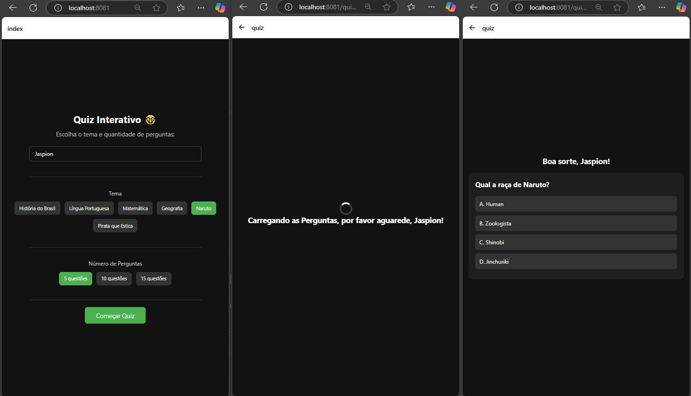

### 14 - Mostrando o resultado

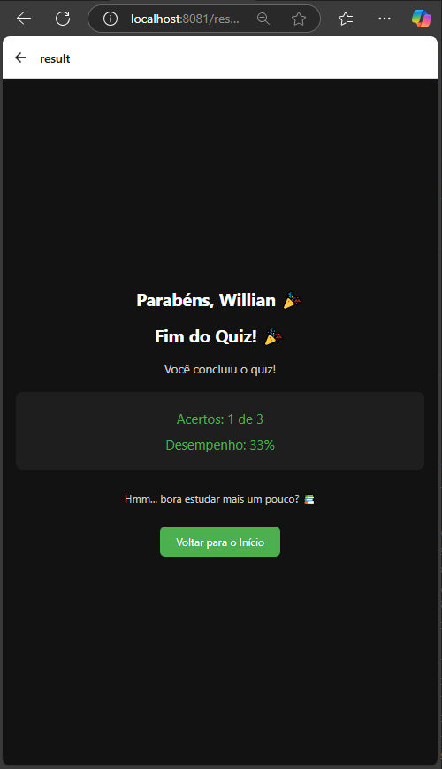

### 15 Ajustes finais

Aqui vamos realizar os ajustes finais para mostrarmos um ranking, gravarmos os resultados, para assim podermos finalizar o nosso projeto. Os códigos vao ser explicados em partes e mostrados na sua totalidade. 

---
Priemeiramente vamos criar um componente cahmado RankingModal.

Explicando o código abaixo: 

- Prop ranking: Recebe um array de objetos Player (com nome, acertos e erros).
- FlatList: Exibe a lista de jogadores e suas informações (nome, acertos, erros, e precisão).
- 
Botões: Permitem resetar o ranking ou fechar o modal.

```tsx
export default function RankingModal({
  visible,
  onClose,
  onReset,
  ranking,
}: RankingModalProps) {
  return (
    <Modal visible={visible} transparent animationType="slide">
      <View style={styles.overlay}>
        <View style={styles.modal}>
          <Text style={styles.title}>🏆 Ranking</Text>
          <FlatList
            data={ranking} // Recebe os dados de ranking
            keyExtractor={(item, index) => index.toString()}
            renderItem={({ item, index }) => {
              const total = item.correct + item.wrong;
              const accuracy = total > 0 ? ((item.correct / total) * 100).toFixed(1) : '0';
              return (
                <Text style={styles.player}>
                  {index + 1}. {item.name} - {item.correct} ✅ / {item.wrong} ❌ ({accuracy}%)
                </Text>
              );
            }}
          />
          <View style={styles.buttons}>
            <TouchableOpacity onPress={onReset} style={styles.resetButton}>
              <Text style={styles.buttonText}>Resetar</Text>
            </TouchableOpacity>
            <TouchableOpacity onPress={onClose} style={styles.closeButton}>
              <Text style={styles.buttonText}>Fechar</Text>
            </TouchableOpacity>
          </View>
        </View>
      </View>
    </Modal>
  );
}

```


<details>
<summary>Código completo:</summary>

```tsx
import React from 'react';
import {
  Modal,
  View,
  Text,
  StyleSheet,
  TouchableOpacity,
  FlatList,
} from 'react-native';

interface Player {
  name: string;
  correct: number;
  wrong: number;
}

interface RankingModalProps {
  visible: boolean;
  onClose: () => void;
  onReset: () => void;
  ranking: Player[];
}

export default function RankingModal({
  visible,
  onClose,
  onReset,
  ranking,
}: RankingModalProps) {
  return (
    <Modal visible={visible} transparent animationType="slide">
      <View style={styles.overlay}>
        <View style={styles.modal}>
          <Text style={styles.title}>🏆 Ranking</Text>
          <FlatList
            data={ranking}
            keyExtractor={(item, index) => index.toString()}
            renderItem={({ item, index }) => {
              const total = item.correct + item.wrong;
              const accuracy = total > 0 ? ((item.correct / total) * 100).toFixed(1) : '0';
              return (
                <Text style={styles.player}>
                  {index + 1}. {item.name} - {item.correct} ✅ / {item.wrong} ❌ ({accuracy}%)
                </Text>
              );
            }}
          />
          <View style={styles.buttons}>
            <TouchableOpacity onPress={onReset} style={styles.resetButton}>
              <Text style={styles.buttonText}>Resetar</Text>
            </TouchableOpacity>
            <TouchableOpacity onPress={onClose} style={styles.closeButton}>
              <Text style={styles.buttonText}>Fechar</Text>
            </TouchableOpacity>
          </View>
        </View>
      </View>
    </Modal>
  );
}

const styles = StyleSheet.create({
  overlay: {
    flex: 1,
    backgroundColor: '#000000aa',
    justifyContent: 'center',
    alignItems: 'center',
  },
  modal: {
    backgroundColor: '#fff',
    padding: 20,
    borderRadius: 12,
    width: '85%',
    maxHeight: '70%',
  },
  title: {
    fontSize: 22,
    fontWeight: 'bold',
    marginBottom: 12,
    textAlign: 'center',
  },
  player: {
    fontSize: 16,
    marginVertical: 4,
  },
  buttons: {
    flexDirection: 'row',
    justifyContent: 'space-between',
    marginTop: 20,
  },
  resetButton: {
    backgroundColor: '#f44336',
    padding: 10,
    borderRadius: 8,
  },
  closeButton: {
    backgroundColor: '#2196f3',
    padding: 10,
    borderRadius: 8,
  },
  buttonText: {
    color: '#fff',
    fontWeight: 'bold',
  },
});

```
</details>
---

Tela de Resultado (result.tsx): 

Aqui foram implementados alguns ajustes para salvarmos os resultados do jogador, para então podermos processar os mesmos na modal.

No ajuste abaixo, temos os seguintes resultados: 

- useEffect: Ao carregar a tela, buscamos o ranking do AsyncStorage, e com a função updateRanking, atualizamos o ranking com os dados do jogador.
- AsyncStorage.getItem: Carrega os dados de ranking (se houver).
- AsyncStorage.setItem: Salva os dados atualizados de ranking no armazenamento local.

```tsx
useEffect(() => {
  (async () => {
    const stored = await AsyncStorage.getItem('ranking'); // Buscando dados do AsyncStorage
    const parsed: Player[] = stored ? JSON.parse(stored) : []; // Parse dos dados, ou vazio se não houver

    const updated = updateRanking(parsed, playerName, numericScore, numericWrong);
    await AsyncStorage.setItem('ranking', JSON.stringify(updated)); // Salvando dados no AsyncStorage
    setRanking(updated); // Atualizando o estado para exibir o ranking atualizado
  })();
}, []);
```

- Atualização do ranking (updateRanking, exposta abaixo): A função verifica se o jogador já existe na lista. Se existir, atualiza os acertos e erros; se não, adiciona o jogador. Em seguida, ordena o ranking com base na precisão (acertos / erros).

```tsx

const updateRanking = (list: Player[], playerName: string, correct: number, wrong: number): Player[] => {
  const existing = list.find(p => p.name === playerName);
  if (existing) {
    existing.correct += correct; // Atualiza os acertos
    existing.wrong += wrong; // Atualiza os erros
  } else {
    list.push({ name: playerName, correct, wrong }); // Adiciona um novo jogador se não existir
  }

  return list.sort((a, b) => (b.correct / (b.wrong || 1)) - (a.correct / (a.wrong || 1))); // Ordena pelo ratio de acertos
};
```

<details>
<summary>Código completo do quiz.tsx</summary>

```tsx
import { View, StyleSheet, ActivityIndicator, Text } from 'react-native';
import { useEffect, useState } from 'react';
import { loadQuestions } from '../data/questions';
import QuestionCard from '../components/QuestionCard';
import { useRouter } from 'expo-router';
import { useLocalSearchParams } from 'expo-router';

export default function QuizScreen() {
  const [questions, setQuestions] = useState<any[]>([]);
  const [currentIndex, setCurrentIndex] = useState(0);
  const [score, setScore] = useState(0);
  const [loading, setLoading] = useState(true);
  const router = useRouter();
  const { selectedCategory, selectedCount, name  } = useLocalSearchParams();
  

  const category = selectedCategory as string;
  const count = parseInt(selectedCount as string);
  const playerName = name as string;

  console.log('Categoria:', category);
  console.log('Número de perguntas:', count);

  useEffect(() => {
    (async () => {
      const loaded = await loadQuestions(category, count);
      setQuestions(loaded);
      setLoading(false);
    })();
  }, []);

  const handleAnswer = (isCorrect: boolean) => {
    if (isCorrect) {
      setScore(prev => prev + 1);
    }
  };

  const handleNext = () => {
    if (currentIndex < questions.length - 1) {
      setCurrentIndex(currentIndex + 1);
    } else {
      router.replace({
        pathname: '/result',
        params: {
          score: score.toString(),
          total: questions.length.toString(),
          name: playerName,
        },
      });
    }
  };

  if (loading) {
    return (
      <View style={styles.container}>
        <ActivityIndicator size="large" color="#fff" />
        <Text style={styles.greeting}>Carregando as Perguntas, por favor aguarede, {playerName}!</Text>
      </View>
    );
  }

  return (
    <View style={styles.container}>
      <Text style={styles.greeting}>Boa sorte, {playerName}!</Text>
      <QuestionCard
        question={questions[currentIndex]}
        onNext={handleNext}
        isLast={currentIndex === questions.length - 1}
        onAnswer={handleAnswer}
      />
    </View>
  );
}

const styles = StyleSheet.create({
  container: {
    flex: 1,
    justifyContent: 'center',
    padding: 16,
    backgroundColor: '#121212',
  },
  greeting: {
    fontSize: 22,
    color: '#fff',
    fontWeight: 'bold',
    marginBottom: 20,
    textAlign: 'center',
  },
});

```
</details>
---

Dentro do index, temos os seguintes ajustes:

- useEffect: Quando showRanking for verdadeiro (modal de ranking aberto), ele carrega o ranking do AsyncStorage, ordena pelo ratio de acertos e erros, e atualiza o estado do ranking.
- AsyncStorage.getItem: Usado para pegar os dados do ranking.
- AsyncStorage.removeItem: Usado para limpar os dados de ranking, resetando o histórico.

```tsx
const [showRanking, setShowRanking] = useState(false);
const [ranking, setRanking] = useState<Player[]>([]);

useEffect(() => {
  if (showRanking) {
    (async () => {
      const stored = await AsyncStorage.getItem('ranking'); // Buscando dados do AsyncStorage
      const parsed: Player[] = stored ? JSON.parse(stored) : [];
      const sorted = parsed.sort((a, b) => {
        const ratioA = a.correct / (a.wrong || 1);
        const ratioB = b.correct / (b.wrong || 1);
        return ratioB - ratioA;
      });
      setRanking(sorted); // Atualizando o estado para mostrar o ranking ordenado
    })();
  }
}, [showRanking]);

const resetRanking = async () => {
  await AsyncStorage.removeItem('ranking'); // Resetando os dados no AsyncStorage
  setRanking([]); // Limpando o estado local
  setShowRanking(false); // Fechando o modal
};

```

Abaixo, exibe o ranking. O RankingModal é passado com a visibilidade (visible), função de fechar (onClose), reset (onReset), e o ranking atualizado.

```tsx
<RankingModal
  visible={showRanking}
  onClose={() => setShowRanking(false)}
  onReset={resetRanking}
  ranking={ranking}
/>

```

<details>
<summary>Código completo do index.tsx</summary>

```tsx
// app/index.tsx
import { View, Text, StyleSheet, TouchableOpacity, TextInput } from 'react-native';
import { useRouter } from 'expo-router';
import { useEffect, useState } from 'react';
import { OptionSelector } from '@/components/OptionSelector';
import RankingModal from '@/components/RankingModal';
import AsyncStorage from '@react-native-async-storage/async-storage';
import Toast from 'react-native-toast-message';

interface Player {
  name: string;
  correct: number;
  wrong: number;
}

const categories = ['História do Brasil', 'Língua Portuguesa', 'Matemática', 'Geografia', 'Naruto', 'Pirata que Estica'];
const questionCounts = [5, 10, 15];

export default function HomeScreen() {
  const router = useRouter();
  const [selectedCategory, setSelectedCategory] = useState<string>('História do Brasil');
  const [selectedCount, setSelectedCount] = useState<number>(5);
  const [playerName, setPlayerName] = useState('');
  const [showRanking, setShowRanking] = useState(false);
  const [ranking, setRanking] = useState<Player[]>([]);

  const startQuiz = () => {
    if (!playerName.trim()) {
      Toast.show({
        type: 'error',
        text1: '⚠️ Nome obrigatório',
        text2: 'Por favor, digite seu nome para começar o quiz.',
        position: 'top',
        visibilityTime: 3000, // milissegundos
        autoHide: true,
        topOffset: 300,
        bottomOffset: 40,
      });
      return;
    }
    router.push({
      pathname: '/quiz',
      params: {
        name: playerName,
        selectedCategory,
        selectedCount: selectedCount.toString(),
      },
    });
  };

  useEffect(() => {
    if (showRanking) {
      (async () => {
        const stored = await AsyncStorage.getItem('ranking');
        const parsed: Player[] = stored ? JSON.parse(stored) : [];
        const sorted = parsed.sort((a, b) => {
          const ratioA = a.correct / (a.wrong || 1);
          const ratioB = b.correct / (b.wrong || 1);
          return ratioB - ratioA;
        });
        setRanking(sorted);
      })();
    }
  }, [showRanking]);

  const resetRanking = async () => {
    await AsyncStorage.removeItem('ranking');
    setRanking([]);
    setShowRanking(false);
  };

  return (
    <View style={styles.container}>
      <Text style={styles.title}>Quiz Interativo 🤓</Text>
      <Text style={styles.subtitle}>Escolha o tema e quantidade de perguntas:</Text>
      <TextInput
        style={styles.input}
        placeholder="Seu nome"
        placeholderTextColor="#888"
        value={playerName}
        onChangeText={setPlayerName}
      />

      <View style={styles.separator} />
      <OptionSelector
        title="Tema"
        options={categories}
        selected={selectedCategory}
        onSelect={setSelectedCategory}
      />
      <View style={styles.separator} />
      <OptionSelector
        title="Número de Perguntas"
        options={questionCounts}
        selected={selectedCount}
        onSelect={setSelectedCount}
        renderLabel={(n) => `${n} questões`}
      />
      <View style={styles.separator} />
      <TouchableOpacity style={styles.button} onPress={startQuiz}>
        <Text style={styles.buttonText}>Começar Quiz</Text>
      </TouchableOpacity>

      <TouchableOpacity style={styles.rankingButton} onPress={() => setShowRanking(true)}>
        <Text style={styles.rankingText}>🏆</Text>
      </TouchableOpacity>

      <RankingModal
        visible={showRanking}
        onClose={() => setShowRanking(false)}
        onReset={resetRanking}
        ranking={ranking}
      />
    </View>
  );
}

const styles = StyleSheet.create({
  container: {
    flex: 1,
    backgroundColor: '#121212',
    alignItems: 'center',
    justifyContent: 'center',
    padding: 16,
  },
  title: {
    fontSize: 28,
    fontWeight: 'bold',
    marginBottom: 12,
    color: '#fff',
  },
  subtitle: {
    fontSize: 18,
    color: '#bbb',
    marginBottom: 24,
    textAlign: 'center',
  },
  button: {
    backgroundColor: '#4caf50',
    paddingVertical: 12,
    paddingHorizontal: 32,
    borderRadius: 8,
  },
  buttonText: {
    color: '#fff',
    fontSize: 18,
  },
  separator: {
    height: 1,
    width: '80%',
    backgroundColor: '#333',
    marginVertical: 20,
  },
  input: {
    width: '80%',
    borderWidth: 1,
    borderColor: '#444',
    borderRadius: 8,
    paddingHorizontal: 16,
    paddingVertical: 10,
    color: '#fff',
    fontSize: 16,
    marginBottom: 24,
  },
  rankingButton: {
    position: 'absolute',
    left: 20,
    bottom: 20,
    backgroundColor: '#444',
    borderRadius: 20,
    padding: 12,
  },
  rankingText: {
    color: '#fff',
    fontSize: 18,
  },
});

```
</details>


---

Fluxo de Dados:
Tela de Resultado:
- O resultado do quiz é processado e armazenado no AsyncStorage ao ser calculado.
- O ranking é atualizado e salvo no AsyncStorage.

Tela Principal (Home):

- O usuário inicia o quiz e, após terminar, o nome e os resultados são enviados ao AsyncStorage para serem salvos.
- O botão de "Ver Ranking" carrega os dados do ranking e os exibe.

Modal de Ranking:

- Mostra o ranking atual do AsyncStorage e permite a redefinição, que limpa os dados.

---

### 16 Mais ajustes finais ehehe

Vamos criar a página about.tsx no nosso app, com as seguintes configurações:
So um descritivo de como vai funcionar o nosso jogo.

```tsx
import { View, Text, StyleSheet } from "react-native";

export default function AboutScreen() {
  return (
    <View style={styles.container}>
      <Text style={styles.title}>🎮 Regras do Quiz Interativo 🧠</Text>

      <Text style={styles.description}>
  Bem-vindo ao <Text style={{ fontWeight: 'bold' }}>Quiz Interativo!</Text> Aqui estão as regras do jogo:
  {"\n\n"}
  👉 O quiz consiste em uma determinada quantidade de perguntas. {"\n"}
  👉 Cada pergunta tem 4 alternativas de resposta, sendo apenas uma correta.{"\n"}
  👉 A cada resposta correta, você acumula pontos!{"\n"}
  👉 Ao final do quiz, o ranking será baseado no número de <Text style={{ fontWeight: 'bold' }}>respostas corretas</Text> em comparação com as <Text style={{ fontWeight: 'bold' }}>respostas erradas</Text>.{"\n\n"}

  📋 <Text style={{ fontWeight: 'bold' }}>Pontuação:</Text>
  {"\n"}Cada resposta correta vale 10 pontos.{"\n\n"}
  🏆 <Text style={{ fontWeight: 'bold' }}>Ranking:</Text> O ranking será calculado com base no número de respostas corretas. Quem acertar mais ficará no topo!{"\n"}
  ❌ Respostas erradas não somam pontos, mas influenciam no ranking final.{"\n\n"}
  🏆 = Jogador com mais acertos{"\n"}
  💔 = Jogador com mais respostas erradas{"\n"}
  📋 = Pontuação total
</Text>

    </View>
  );
}

const styles = StyleSheet.create({
  container: {
    flex: 1,
    backgroundColor: '#121212',
    padding: 20,
    alignItems: 'center',
    justifyContent: 'flex-start',
  },
  title: {
    fontSize: 26,
    fontWeight: 'bold',
    color: '#FFF', // Laranja vibrante
    textAlign: 'center',
    marginBottom: 20,
  },
  description: {
    fontSize: 16,
    color: '#fff',
    textAlign: 'left',
    lineHeight: 24,
  },
});

```

Vamos ajustar o nosso Questions.tsx para pegar a quantidade de perguntas selecionado:

```tsx
// data/questions.ts
import { QuestionService } from '../services/QuestionService';

export async function loadQuestions(category: string, count: number) {
  const allQuestions = await QuestionService.fetchQuestionFromOpenAI(category, count);
  return allQuestions.slice(0, count); // pega só as 3 primeiras
}
```


Vamos também ajustar o nossoa rquivo de rotas. So formata as rotas de maneira simples, 

```tsx
import { Stack } from 'expo-router';
import Toast from 'react-native-toast-message';

export default function Layout() {
  return (
    <>
      <Stack>
        <Stack.Screen 
          name="index" 
          options={{
            title: 'Quiz',
            headerStyle: { backgroundColor: '#007F00' },  // Verde forte
            headerTintColor: '#fff',  // Cor do texto e ícones da barra superior
          }} 
        />
        <Stack.Screen 
          name="result" 
          options={{
            title: 'Result',
            headerStyle: { backgroundColor: '#007F00' },  // Verde forte
            headerTintColor: '#fff',  // Cor do texto e ícones da barra superior
          }} 
        /><Stack.Screen 
        name="quiz" 
        options={{
          title: 'quiz',
          headerStyle: { backgroundColor: '#007F00' },  // Verde forte
          headerTintColor: '#fff',  // Cor do texto e ícones da barra superior
        }} 
      />
      </Stack>
      <Toast /> 
    </>
  );
}

```

Ajustem seus icones e sua imagem de fundo se acharem necessoario, dentro do arquivo json.

```json
{
  "expo": {
    "name": "quiz-app",
    "slug": "quiz-app",
    "version": "1.0.0",
    "orientation": "portrait",
    "icon": "./assets/images/quiz.png",
    "scheme": "myapp",
    "userInterfaceStyle": "automatic",
    "newArchEnabled": true,
    "ios": {
      "supportsTablet": true
    },
    "android": {
      "adaptiveIcon": {
        "foregroundImage": "./assets/images/quiz.png",
        "backgroundColor": "#007F00"
      }
    },
    "web": {
      "bundler": "metro",
      "output": "static",
      "favicon": "./assets/images/quiz.png"
    },
    "plugins": [
      "expo-router",
      [
        "expo-splash-screen",
        {
          "image": "./assets/images/quiz.png",
          "imageWidth": 200,
          "resizeMode": "contain",
          "backgroundColor": "#007F00"
        }
      ]
    ],
    "experiments": {
      "typedRoutes": true
    }
  }
}


```

Com isto a nossa aplicação fica da seguinte maneira: 


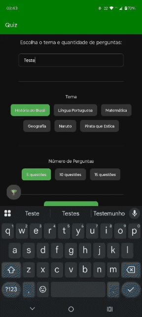


### 17 Gerando um apk do Quiz

Vamos instalar o nosso quiz em nosso celular através de um apk

#### 1 Buildando um apk

---
Antes de continuarmos, devemos criar uma conta na plataforma [EAS](https://expo.dev/signup).(Caso ja tenha conta, pode igonrar esse passo)

Posterior necessitamos intalar o pacote de build do expo. O comando abaixo instala de forma global(Caso ja tenha instalado, pode igonrar esse passo)

```sh
npm install -g eas-cli
```

Logamos na plataforma eas com o seguinte comando
Colocamos usuário e senha criado nos passos anteriores.

```sh
eas login
```

Geramos a configuração do projeto:

```sh
eas build:configure
```

Alteramos o arquivo eas.json criado com as seguintes configurações: 

```json
{
  "build": {
    "preview": {
      "android": {
        "buildType": "apk"
      }
    }
  }
}
```

Posterior buildamos o nosso apk com o seguinte comando: 
Observação: O processo demora em função de estarmos com uma licença free para build na plataforma EAS.

```sh
eas build --profile preview --platform android
```


#### 2 Instalando o app no celular

Pegamos o arquivo gerado através da URL do build. O mesmo vai entregar um arquivo.apk.

Posterior, enviamos esta arquivo APK para o nosso android via drive ou outra ferramenta de escolha. 

Ao final, instalamos o mesmo em nosso celular. Para a instalação ser possível o android tem que estar em modo desenvolvedor e o apk em diretório local.

---


